## Table of contents
* AND
  * [3-input](#and3)
  * [4-input](#and4)
  * [5-input](#and5)
  * [6-input](#and6)
  * [7-input](#and7)
  * [8-input](#and8)
* OR
  * [3-input](#or3)
  * [4-input](#or4)
  * [5-input](#or5)
  * [6-input](#or6)
  * [7-input](#or7)
  * [8-input](#or8)
* NAND
  * [3-input](#nand3)
  * [4-input](#nand4)
  * [5-input](#nand5)
  * [6-input](#nand6)
  * [7-input](#nand7)
  * [8-input](#nand8)

## Schematics

### 1-bit AND3
[Schematic](1-bit%20AND3.sch)  
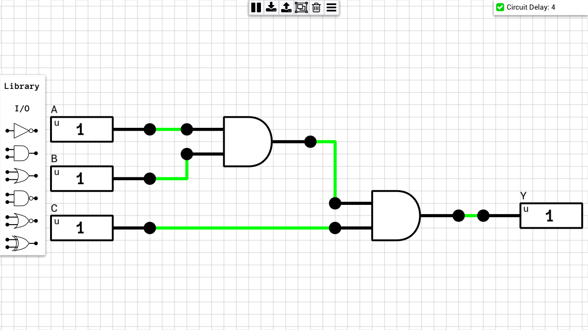

### 1-bit AND4
[Schematic](1-bit%20AND4.sch)  
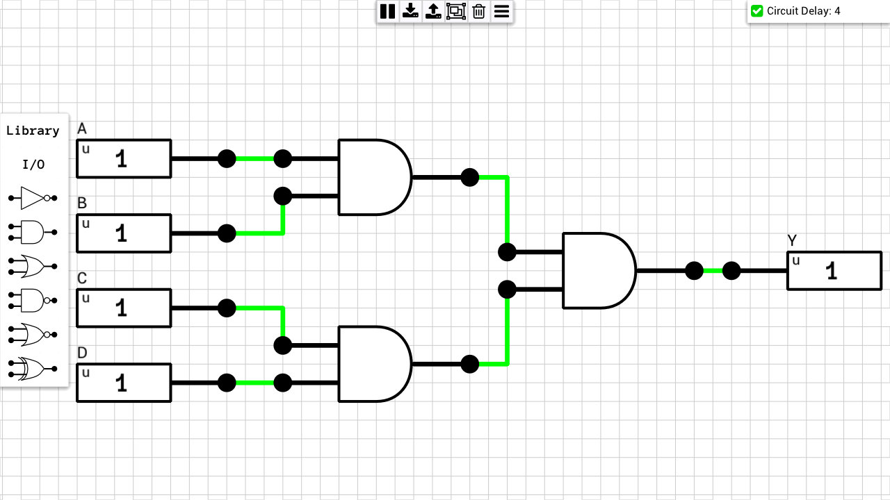

### 1-bit AND5
[Schematic](1-bit%20AND5.sch)  
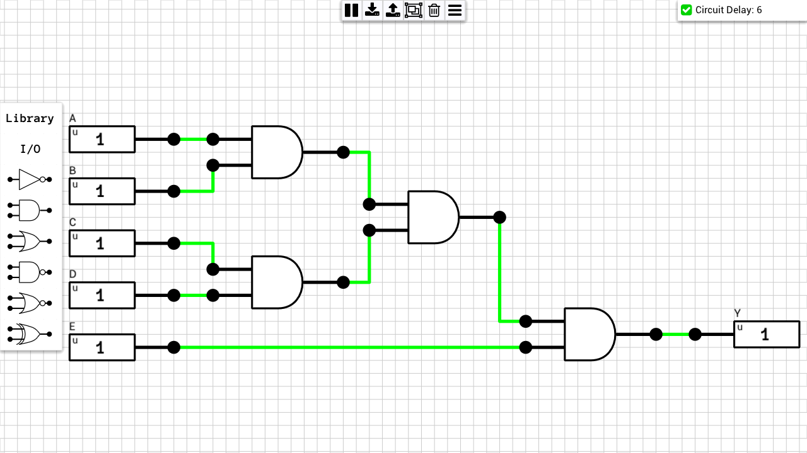

### 1-bit AND6
[Schematic](1-bit%20AND6.sch)  
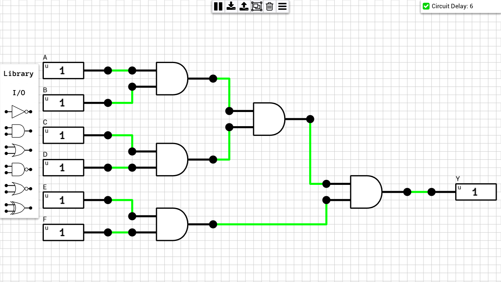

### 1-bit AND7
[Schematic](1-bit%20AND7.sch)  
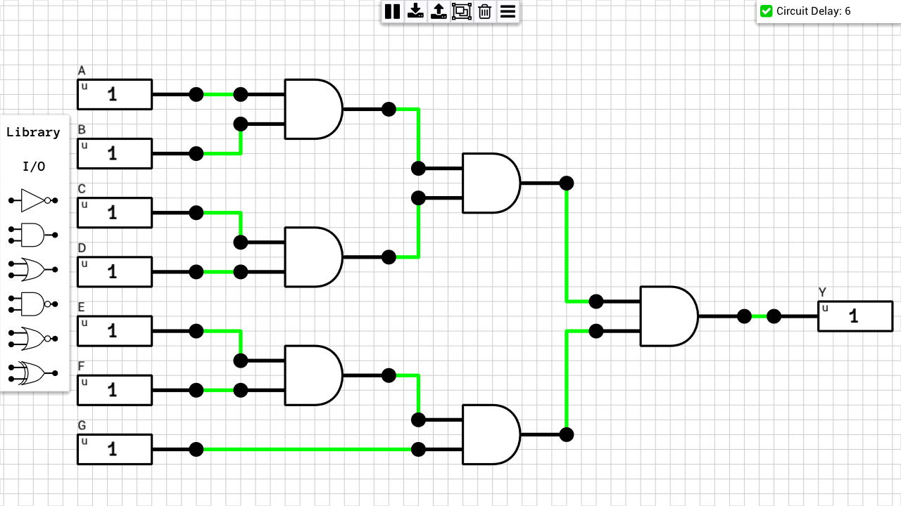

### 1-bit AND8
[Schematic](1-bit%20AND8.sch)  
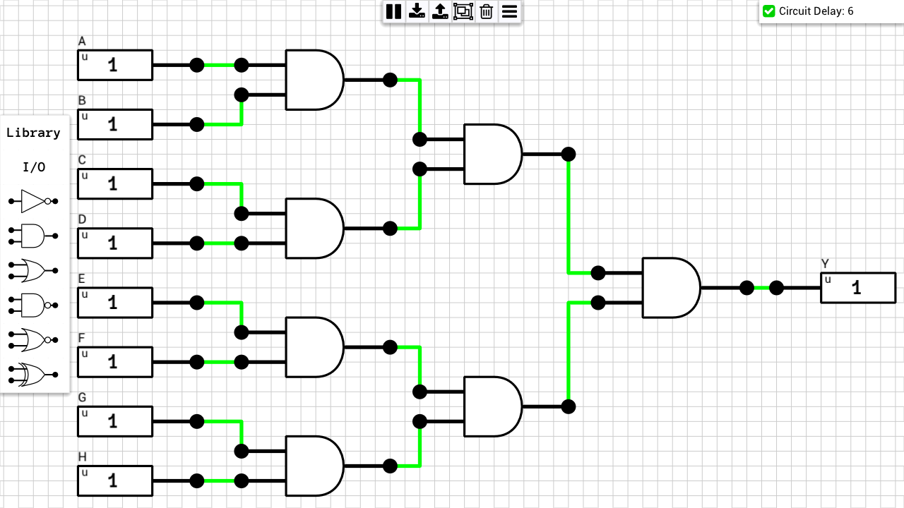

### 1-bit OR3
[Schematic](1-bit%20OR3.sch)  
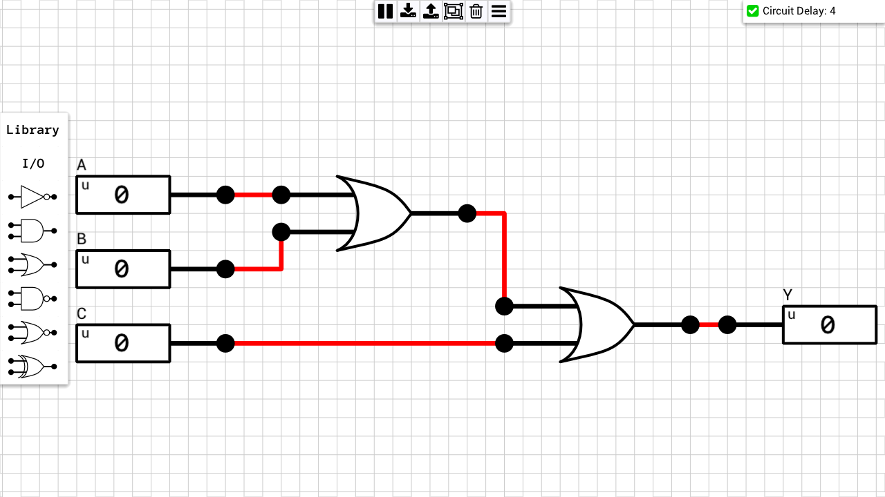

### 1-bit OR4
[Schematic](1-bit%20OR4.sch)  
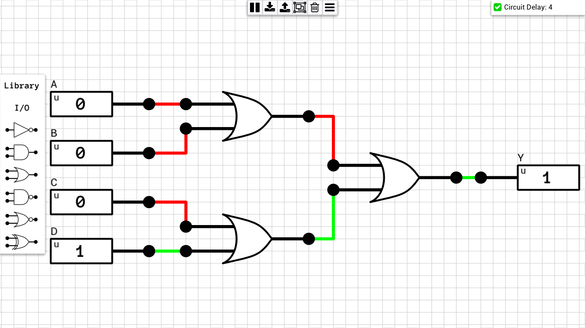

### 1-bit OR5
[Schematic](1-bit%20OR5.sch)  
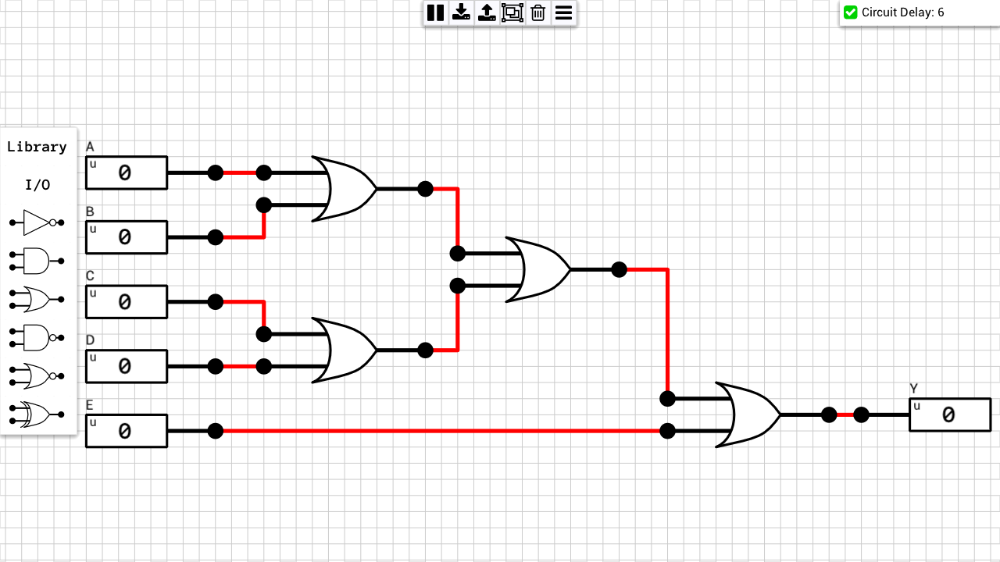

### 1-bit OR6
[Schematic](1-bit%20OR6.sch)  
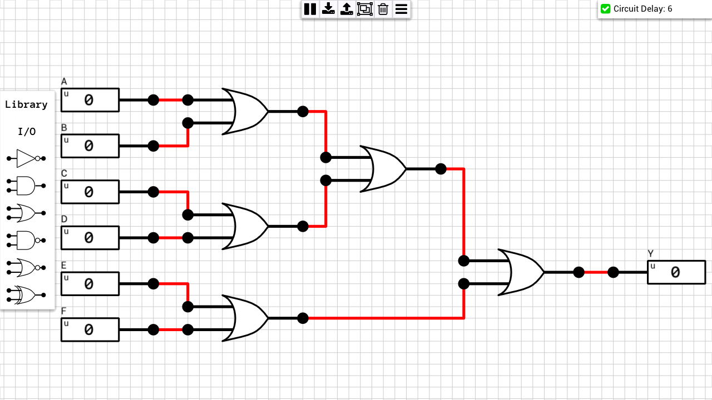

### 1-bit OR7
[Schematic](1-bit%20OR7.sch)  
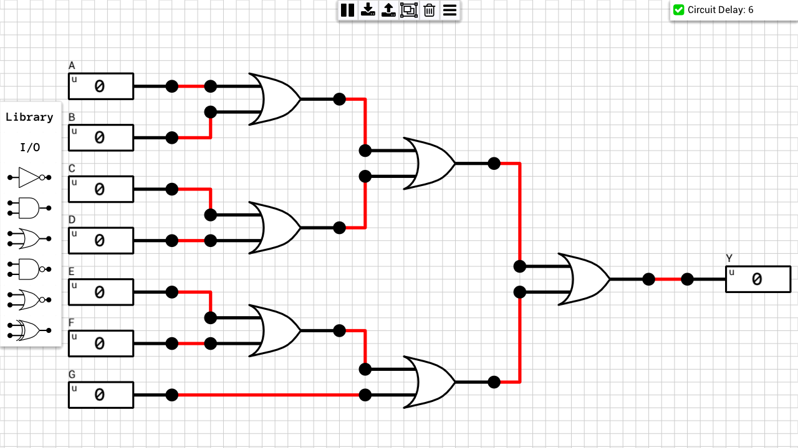

### 1-bit OR8
[Schematic](1-bit%20OR8.sch)  
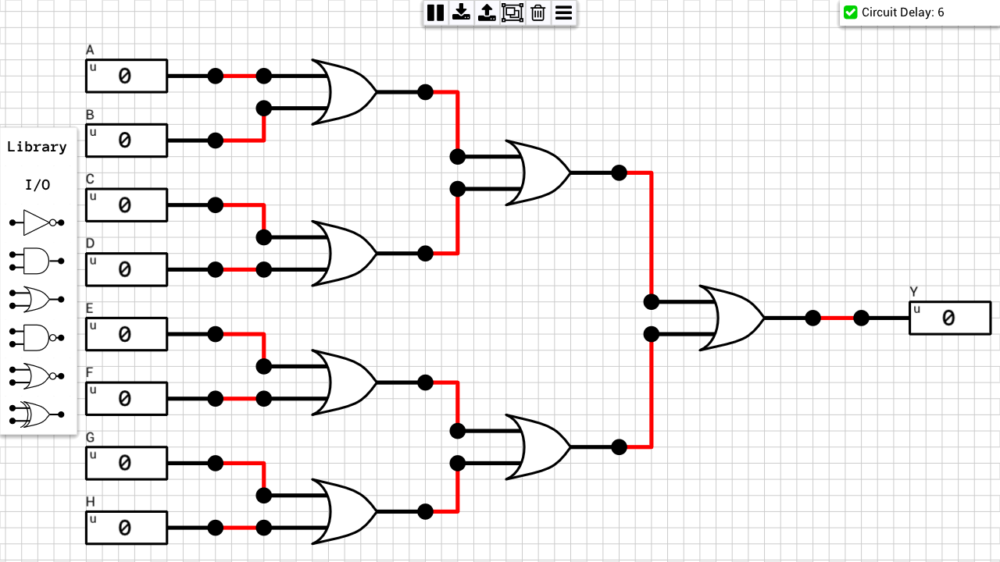

### 1-bit NAND3
[Schematic](1-bit%20NAND3.sch)  
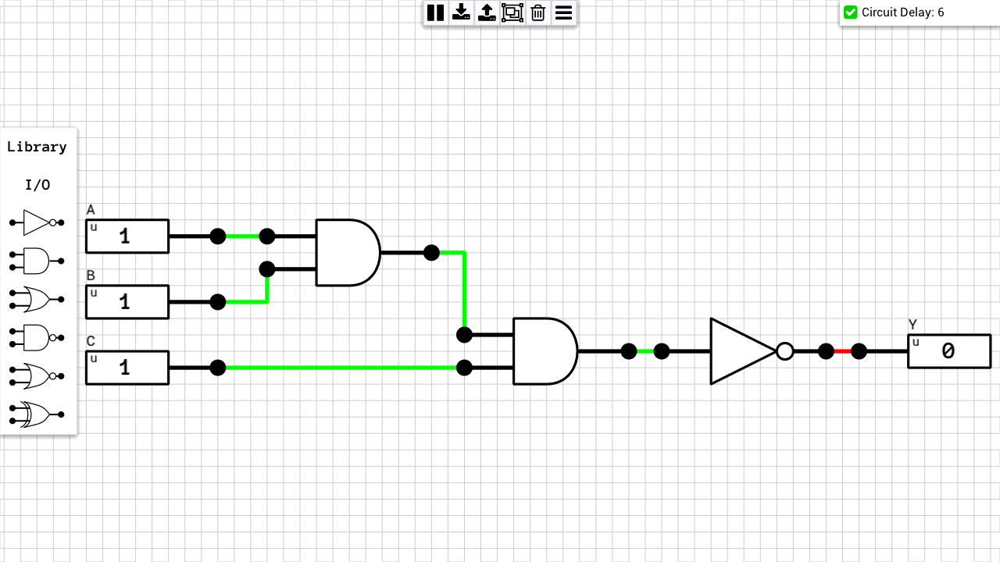

### 1-bit NAND4
[Schematic](1-bit%20NAND4.sch)  
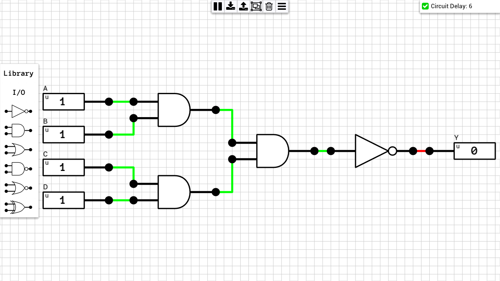

### 1-bit NAND5
[Schematic](1-bit%20NAND5.sch)  
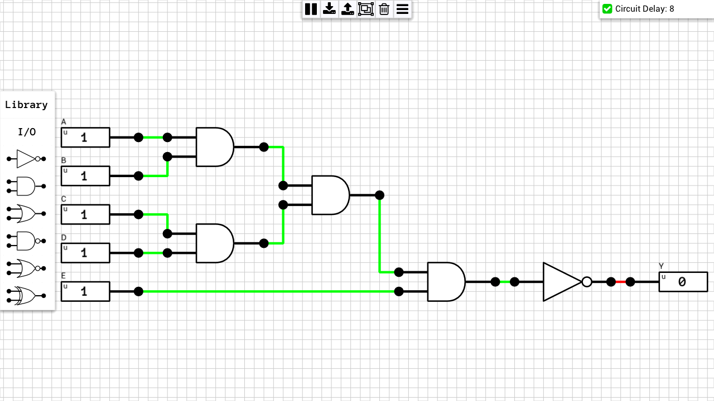

### 1-bit NAND6
[Schematic](1-bit%20NAND6.sch)  
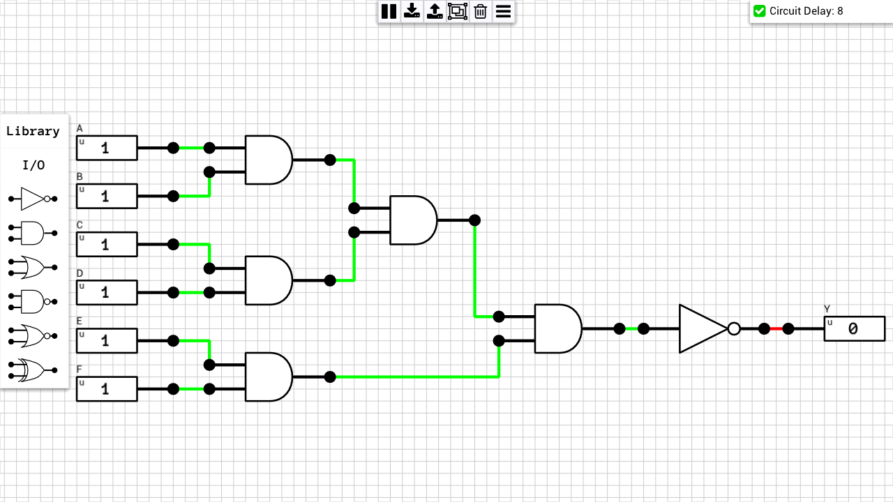

### 1-bit NAND7
[Schematic](1-bit%20NAND7.sch)  

### 1-bit NAND8
[Schematic](1-bit%20NAND8.sch)  
