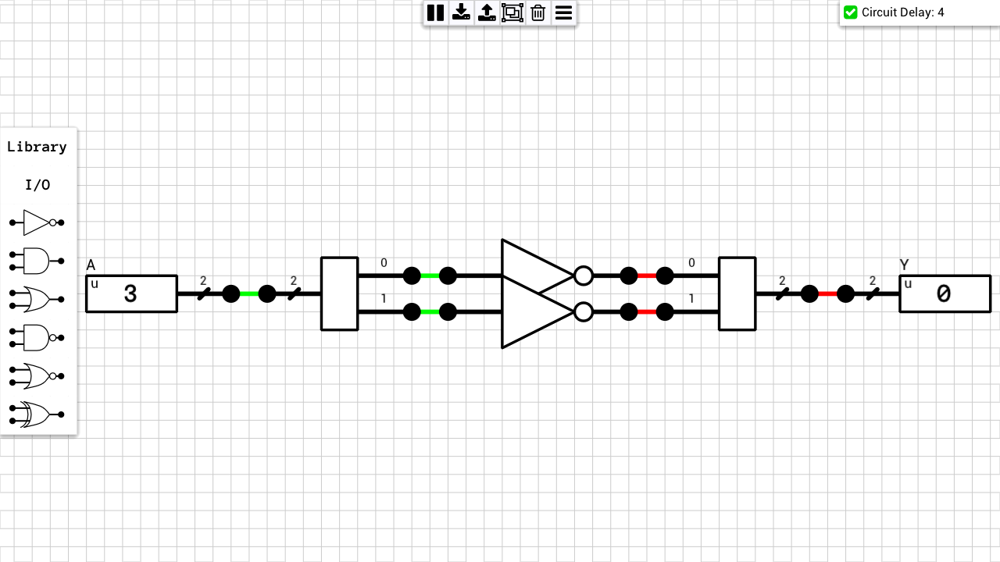
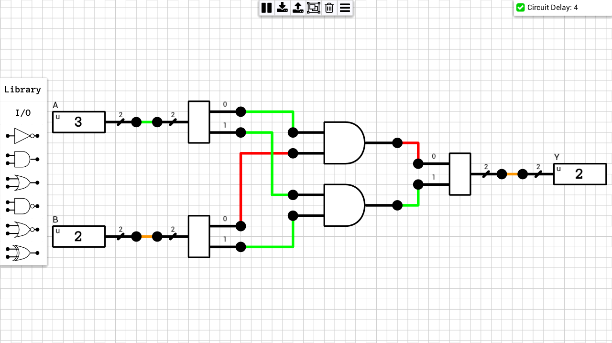
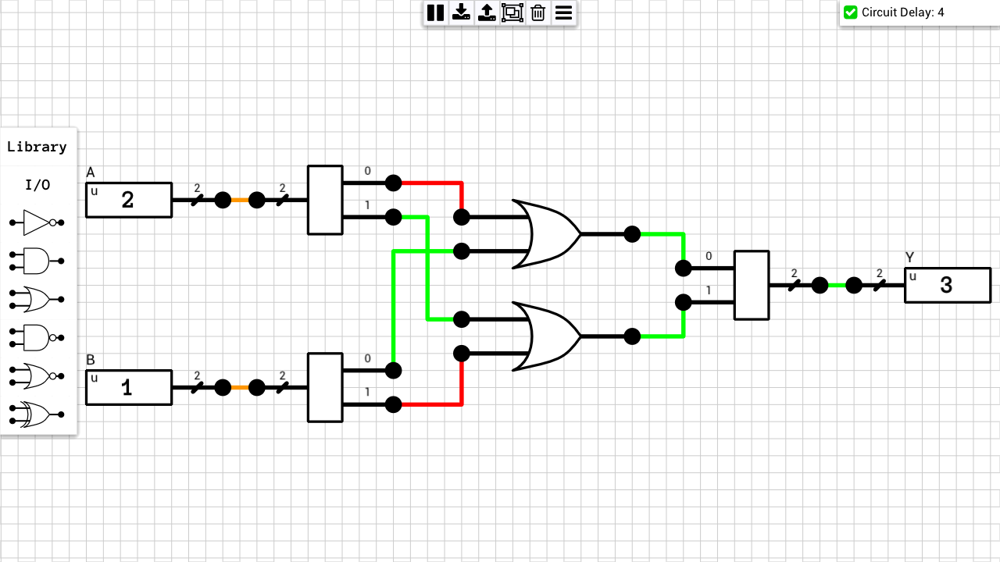
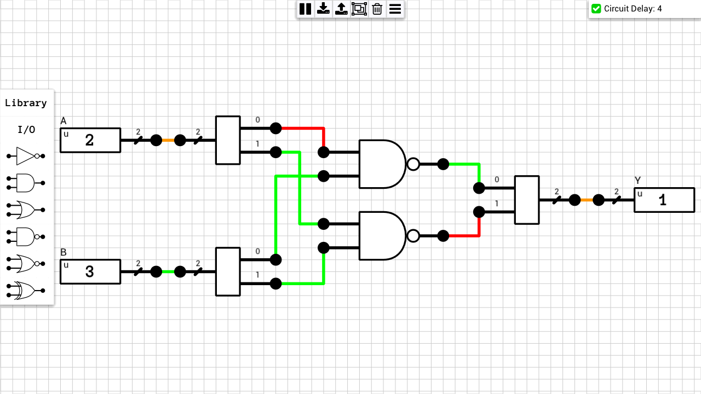
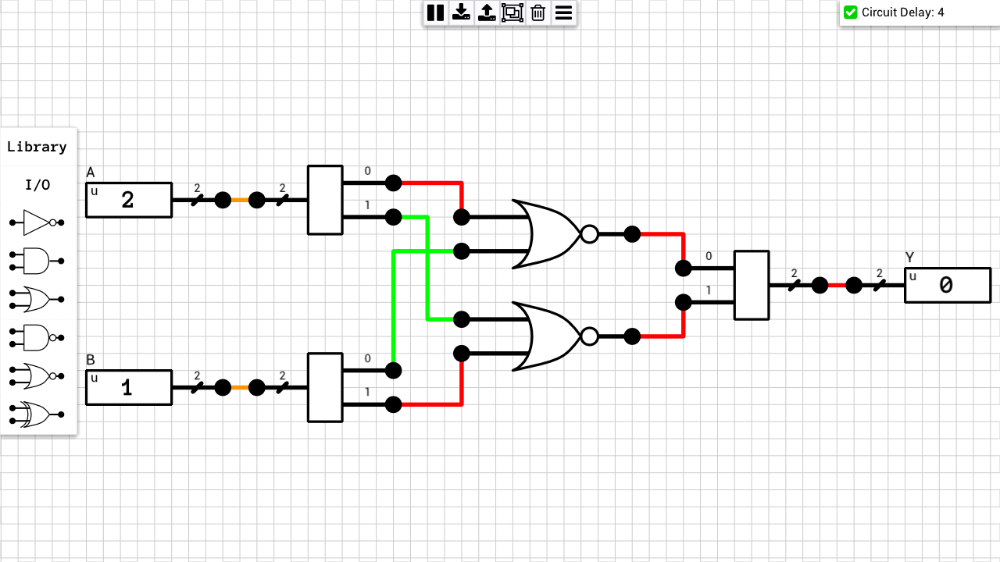
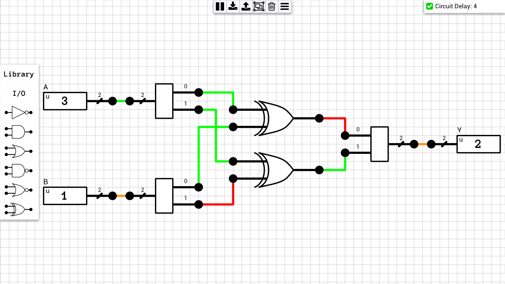

## Table of contents
* [2-bit NOT](#not)
* [2-bit AND](#and)
* [2-bit OR](#or)
* [2-bit NAND](#nand)
* [2-bit NOR](#nor)
* [2-bit XOR](#xor)

## Schematics

### 2-bit NOT
[Schematic](2-bit%20NOT.sch)  

### 2-bit AND
[Schematic](2-bit%20AND.sch)  

### 2-bit OR
[Schematic](2-bit%20OR.sch)  

### 2-bit NAND
[Schematic](2-bit%20NAND.sch)  

### 2-bit NOR
[Schematic](2-bit%20NOR.sch)  

### 2-bit XOR
[Schematic](2-bit%20XOR.sch)  

