Exported from DLS v0.8.1

## Table of contents
* [7400 - 4x NAND2](#7400)
* [7402 - 4x NOR2](#7402)
* [7404 - 6x Inverter](#7404)
* [7408 - 4x AND2](#7408)
* [7410 - 3x NAND3](#7410)
* [7411 - 3x AND3](#7411)
* [7420 - 2x NAND4](#7420)
* [7421 - 2x AND4](#7421)
* [7425 - 2x NOR4](#7425)
* [7427 - 3x NOR3](#7427)
* [7430 - 1x NAND8](#7430)
* [7432 - 4x OR2](#7432)
* [7442 - BCD to Decimal Decoder](#7442)
* [7469 - 2x 4-bit Binary counter](#7469)
* [7474 - 2x D FlipFlop](#7474)
* [7485 - 4-bit Mag. Comparator](#7485)
* [7486 - 4x XOR2](#7486)
* [7487 - 4-bit True/Complement, Zero/One](#7487)

## Schematics

### 7400 - 4x NAND2
[Schematic](7400.sch)  
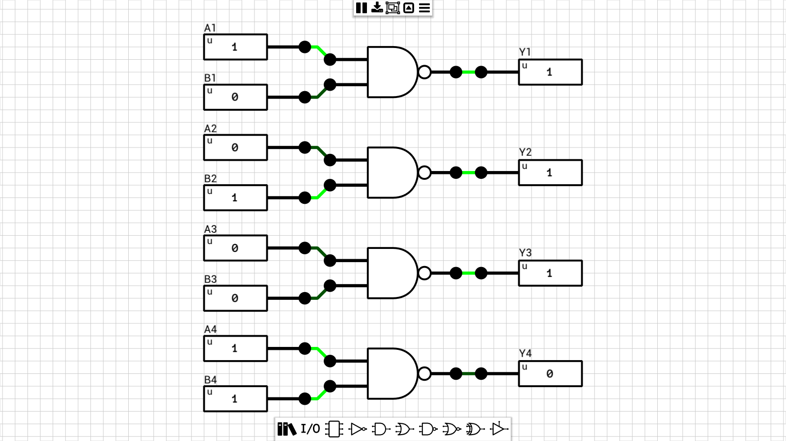

### 7402 - 4x NOR2
[Schematic](7402.sch)  
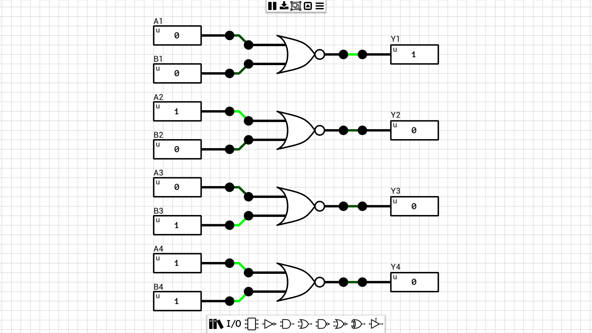

### 7404 - 6x Inverter
[Schematic](7404.sch)  
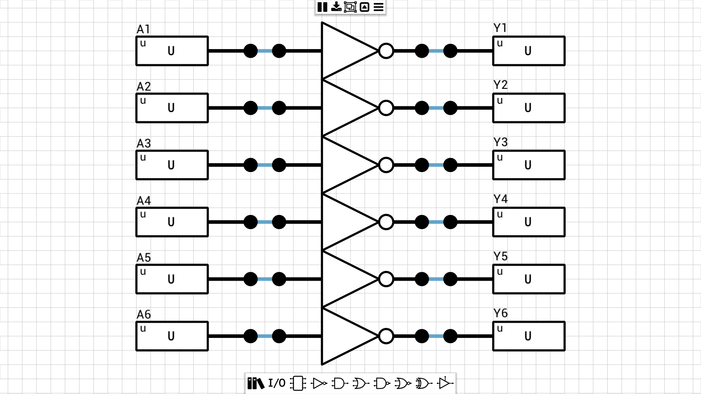

### 7408 - 4x AND2
[Schematic](7408.sch)  
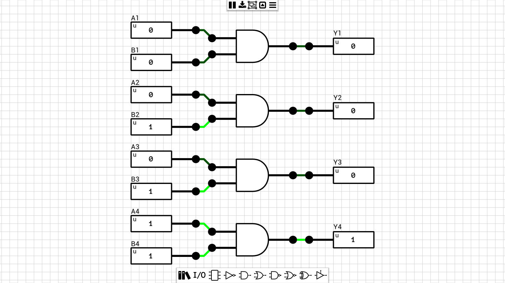

### 7410 - 3x NAND3
[Schematic](7410.sch)  

### 7411 - 3x AND3
[Schematic](7411.sch)  
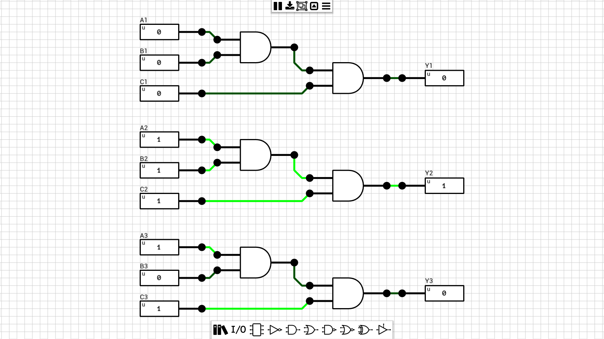

### 7420 - 2x NAND4
[Schematic](7420.sch)  
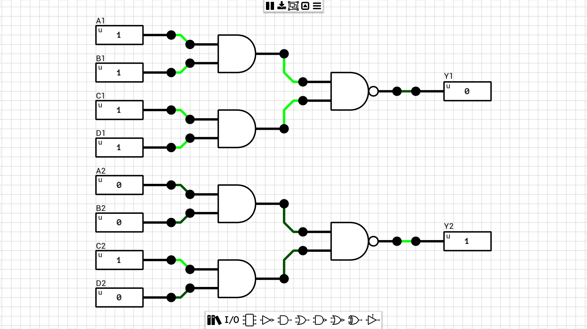

### 7421 - 2x AND4
[Schematic](7421.sch)  
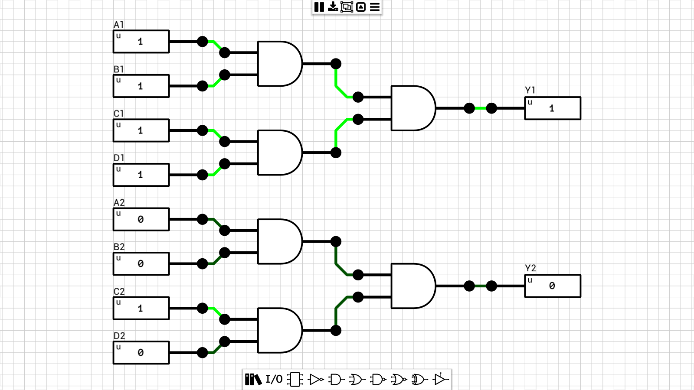

### 7425 - 2x NOR4
[Schematic](7425.sch)  
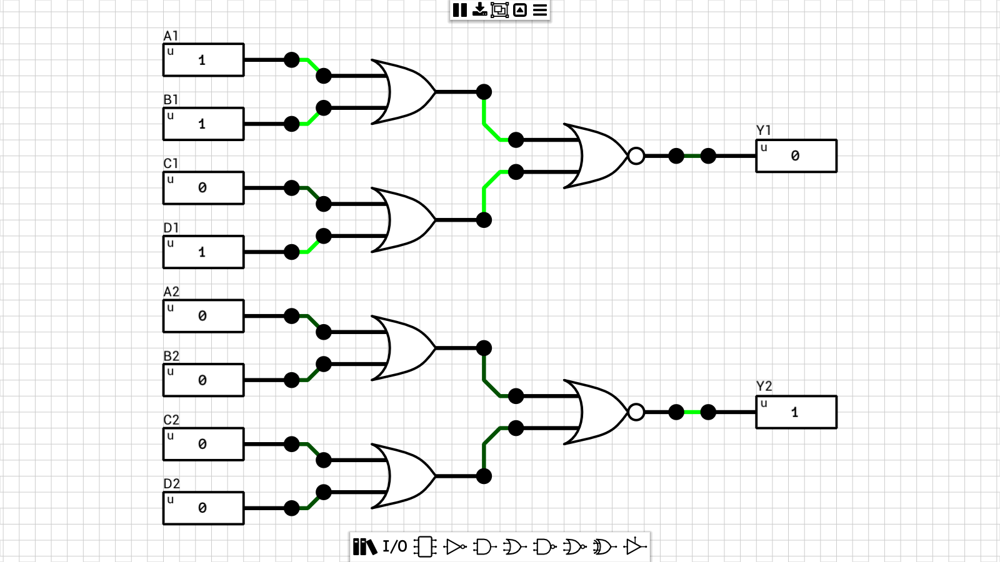

### 7427 - 3x NOR3
[Schematic](7427.sch)  
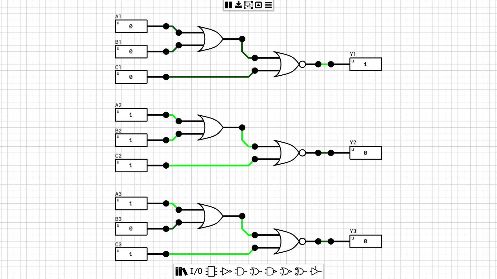

### 7430 - 1x NAND8
[Schematic](7430.sch)  
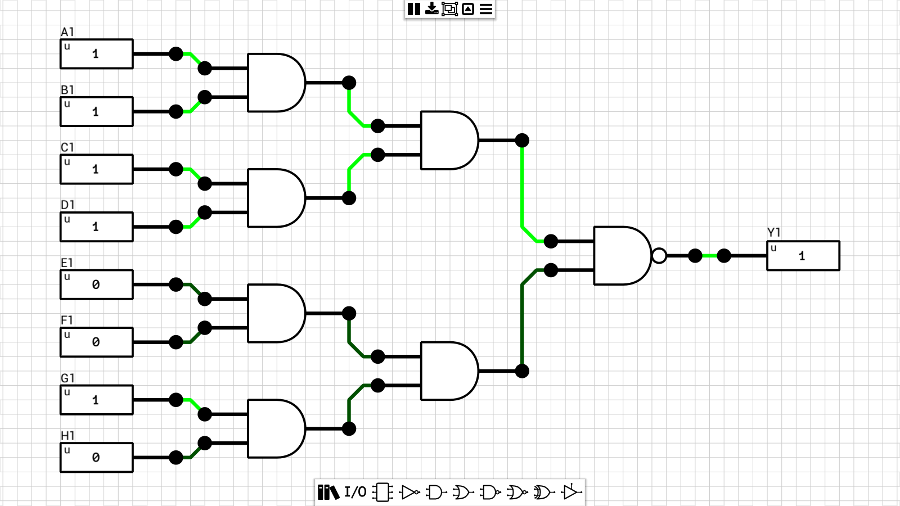

### 7432 - 4x OR2
[Schematic](7432.sch)  
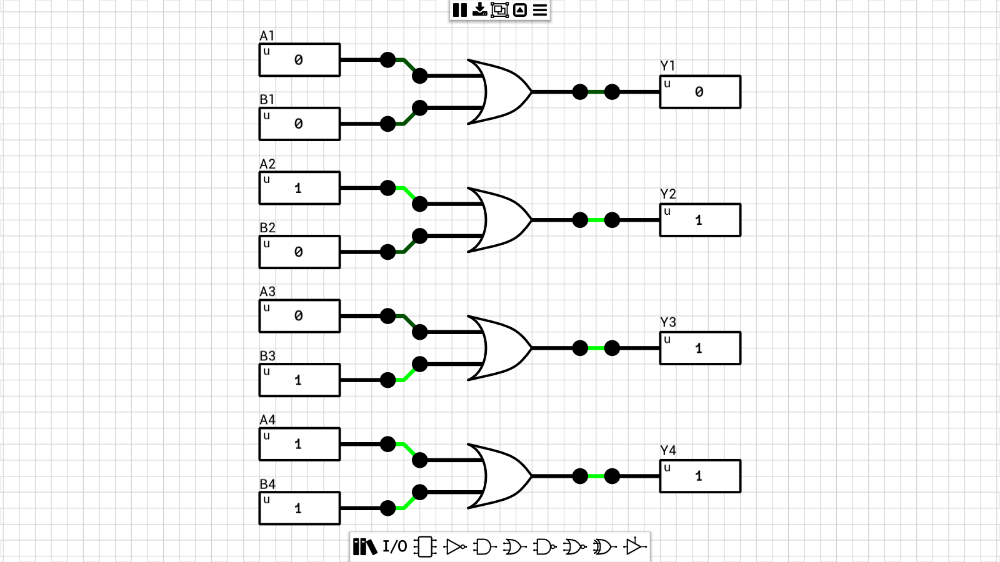

### 7442 - BCD to Decimal decoder
[Schematic](7442.sch)  
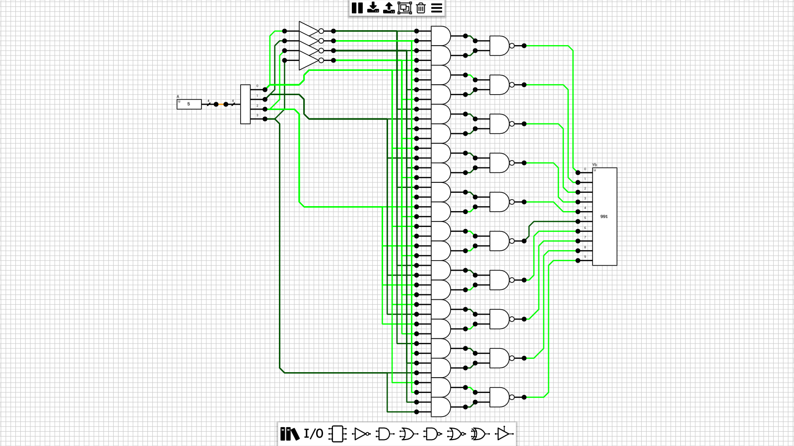

### 7469 - 2x 4-bit Binary counter
[Schematic](7469.sch)  
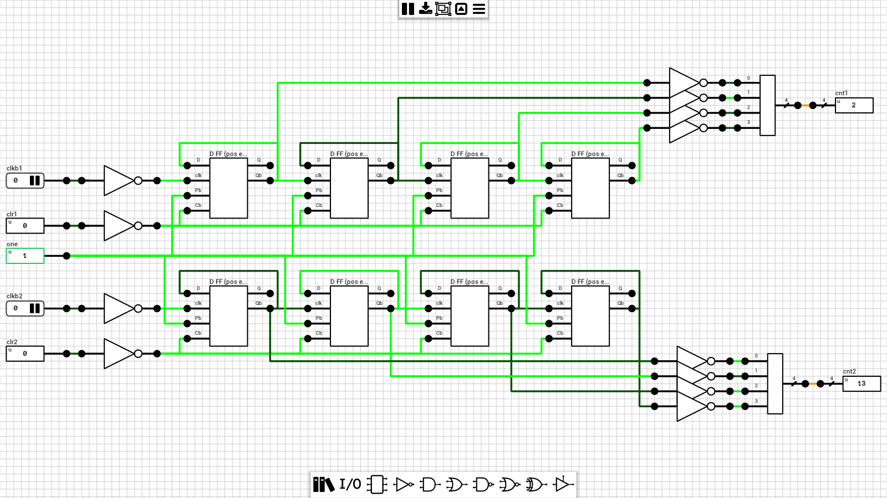

### 7474 - 2x D FlipFlop
[Schematic](7474.sch)  
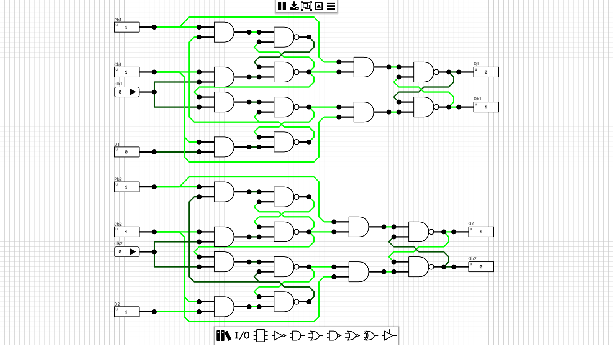

### 7485 - 4-bit Mag. Comparator
[Schematic](7485.sch)  

### 7486 - 4x XOR2
[Schematic](7486.sch)  

### 7487 - 4-bit True/Complement, Zero/One
[Schematic](7487.sch)  
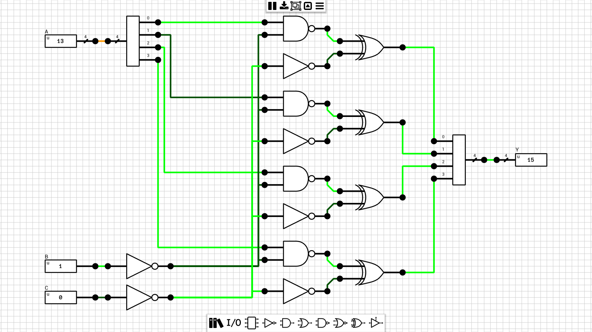
