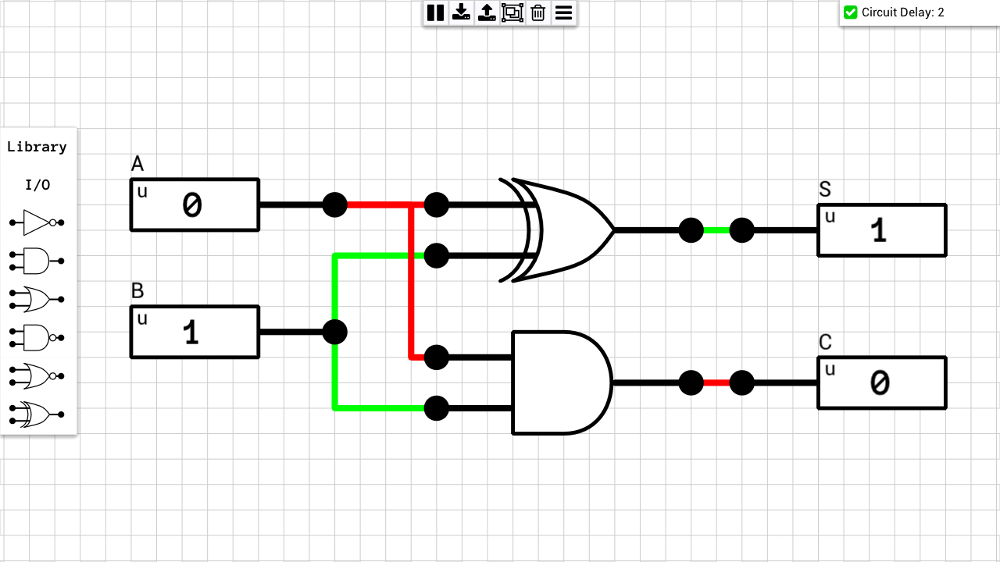
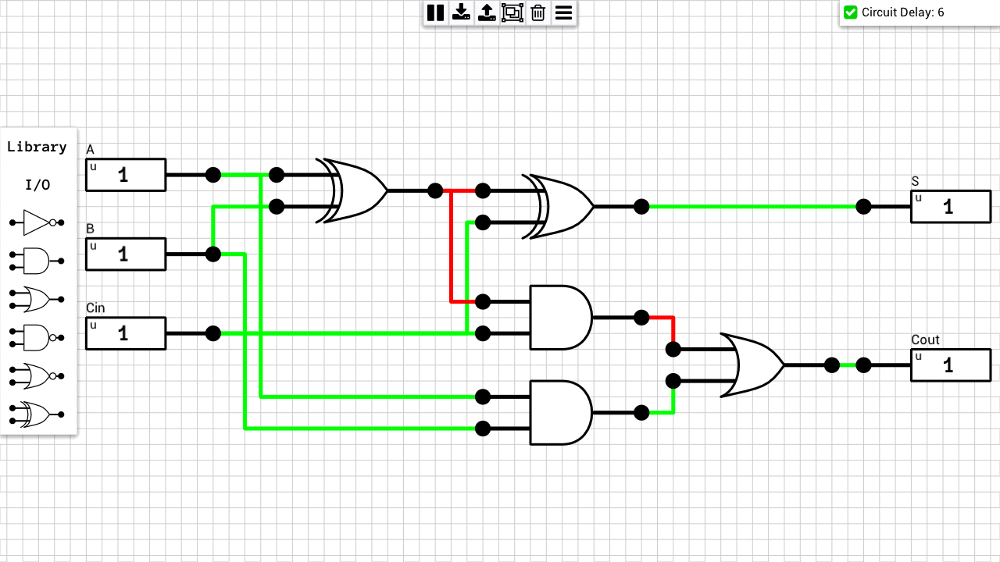
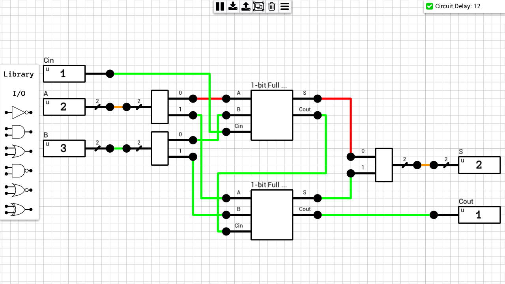

This category includes circuits which perform some arithmetic operation (addition, subtraction, negation, etc.)

## Table of contents
* [Half Adder](#half_adder)
* [1-bit Full Adder](#1bit_full_adder)
* [2-bit Full Adder](#2bit_full_adder)
* [4-bit Full Adder (ripple carry)](#4bit_full_adder)
* [8-bit Full Adder (ripple carry)](#8bit_full_adder)

## Schematics

### Half Adder
[Schematic](Half%20Adder.sch)

### 1-bit Full Adder
[Schematic](1-bit%20Full%20Adder.sch)

### 2-bit Full Adder
[Schematic](2-bit%20Full%20Adder.sch)

### 4-bit Full Adder (ripple carry)
[Schematic](4-bit%20Full%20Adder.sch)
")

### 8-bit Full Adder (ripple carry)
[Schematic](8-bit%20Full%20Adder.sch)
")