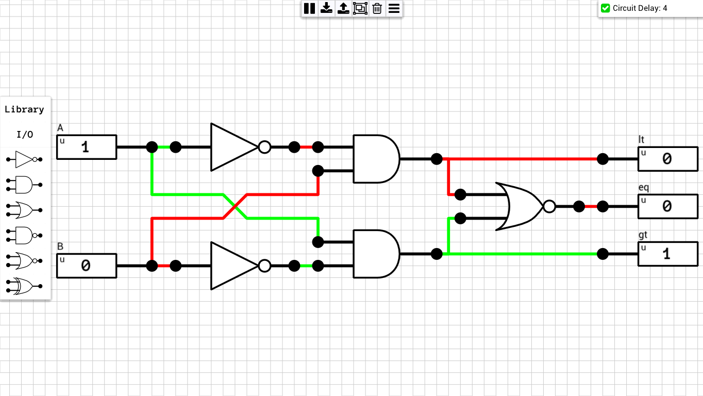

Comparators are circuits which compare 2 N-bit input values and output 1-bit signals which indicate the relation between the two inputs. Magnitude comparators have 3 outputs, one for each if the cases `A < B`, `A = B` and `A > B`. Equality comparators have only one output which indicate whether the 2 inputs are equal or not.

## Table of contents
* [1-bit Magnitude Comparator](#1bit_mag_compare)
* [4-bit Magnitude Comparator](#4bit_mag_compare)

## Schematics

### 1-bit Magnitude Comparator
[Schematic](1-bit%20Mag.%20Comparator.sch)

### 4-bit Magnitude Comparator
Includes additional inputs for cascading, in order to create larger comparators (e.g. 8-bit). The extra input of the first comparator should be set to the following values: `lt => 0, eq => 1, gt => 0`  
[Schematic](2-bit%20Mag.%20Comparator.sch)

