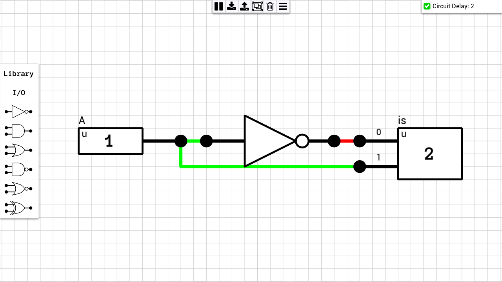
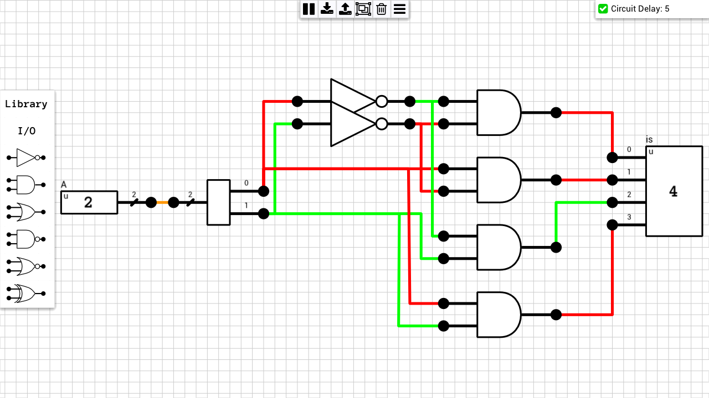
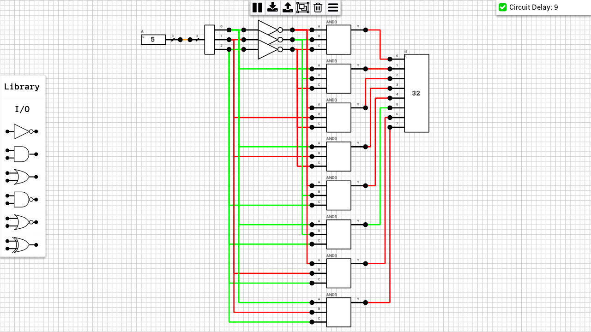

Decoders are circuits which convert a N-bit input signal into 2N 1-bit output signals. Only one of the output signals will be HIGH (1) for any given input value. If the i-th output is 1, it means that the input had a value of `i`.

**NOTE**: 
1. All the circuits in this category use components from the [1-bit Multi-input Gates](https://github.com/jdryg/dls-schematics/tree/master/1-bit%20Multi-input%20Gates) category.
2. Since the outputs from each circuit are 2N independent signals, I could have used 2N 1-bit output ports. I decided to use a normal 2N-bit output port. When you componentize the circuits below, the generated component will have 2N output pins, since the output port is not a bus.

## Table of contents
* [1-to-2 Decoder](#1to2_decoder)
* [2-to-4 Decoder](#2to4_decoder)
* [3-to-8 Decoder](#3to8_decoder)

## Schematics

### 1-to-2 Decoder
[Schematic](1-to-2%20Decoder.sch)  

### 2-to-4 Decoder
[Schematic](2-to-4%20Decoder.sch)  

### 3-to-8 Decoder
[Schematic](3-to-8%20Decoder.sch)  

