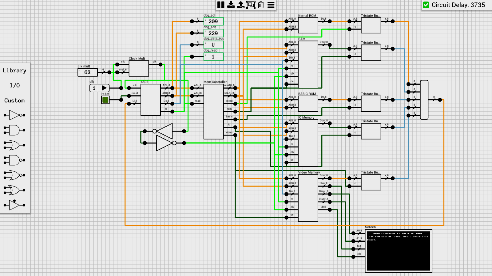

A 6502 compatible CPU (should be cycle accurate) and C64 Kernal/BASIC ROM.

**NOTE**: Requires DLS v0.6.0 or later (.sch v1.3) because it includes scripted components.

Configured to run at 3.78kHz (clock multiplier = 63). You can enable instruction logging by editing the 6502 component and changing the ENABLE_LOGGING variable to true.

Boot time is approximately 30sec from reset to the READY prompt. No keyboard support at the moment as this requires additions to the simulator.

## Schematic
### 6502
[Schematic](6502.sch)

