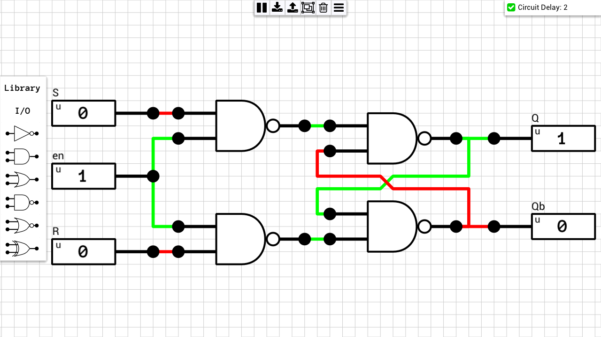
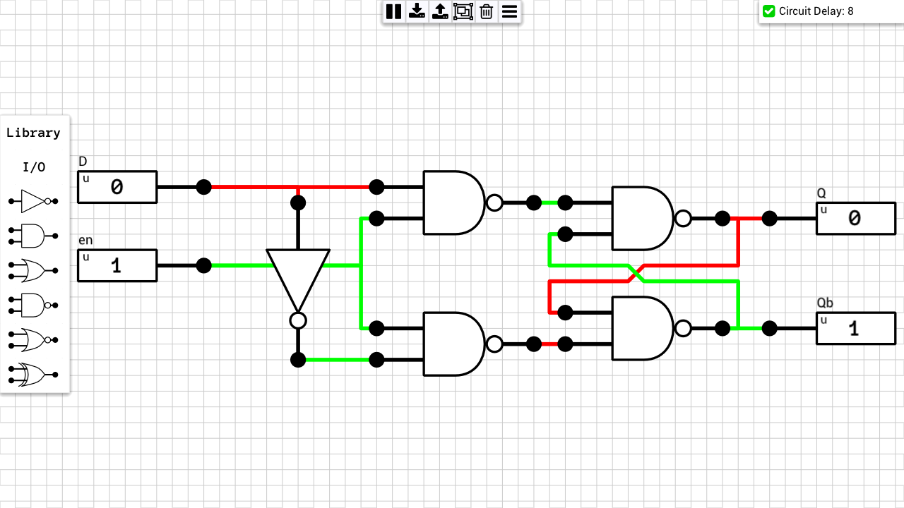
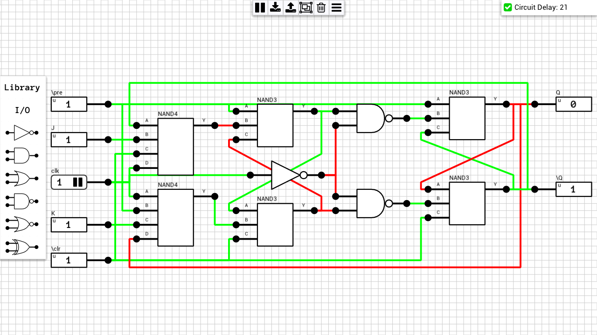
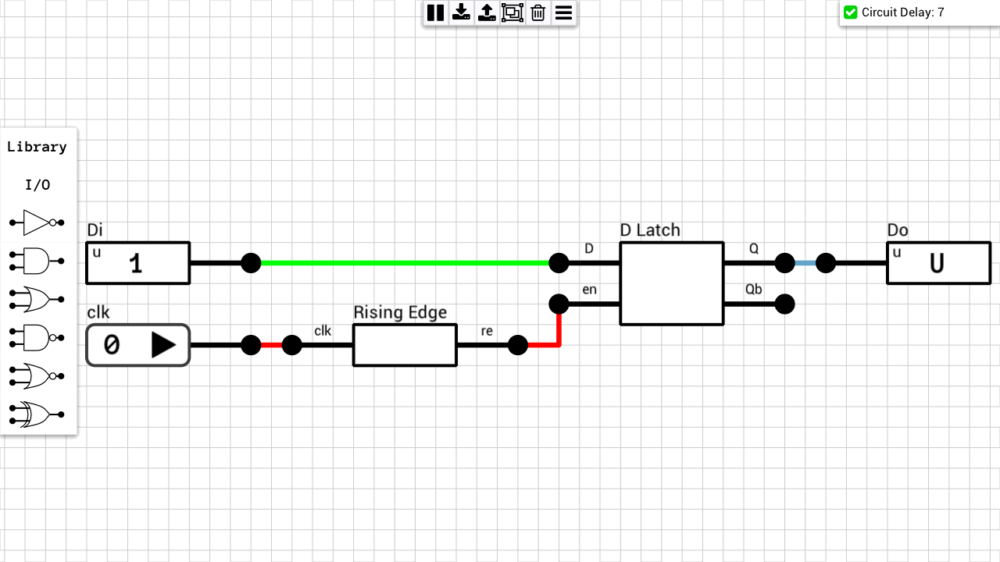
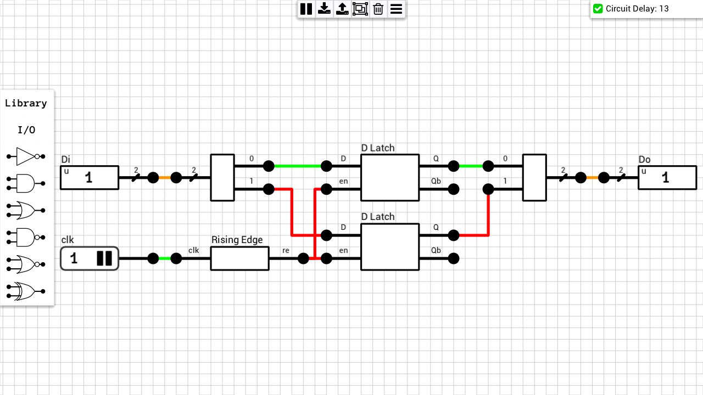
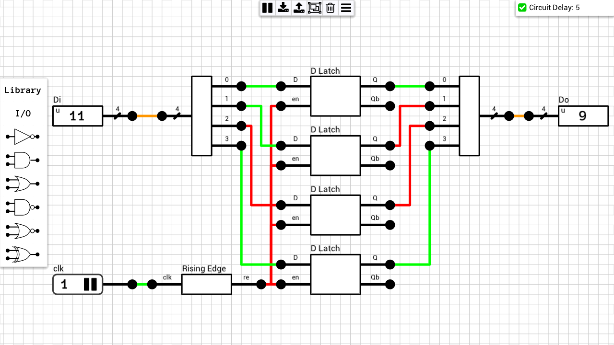
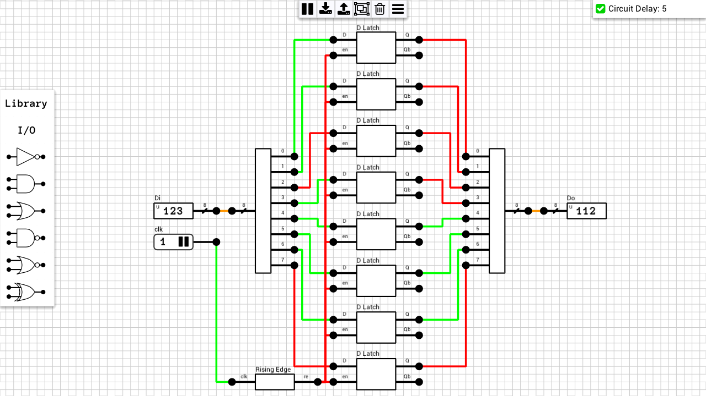
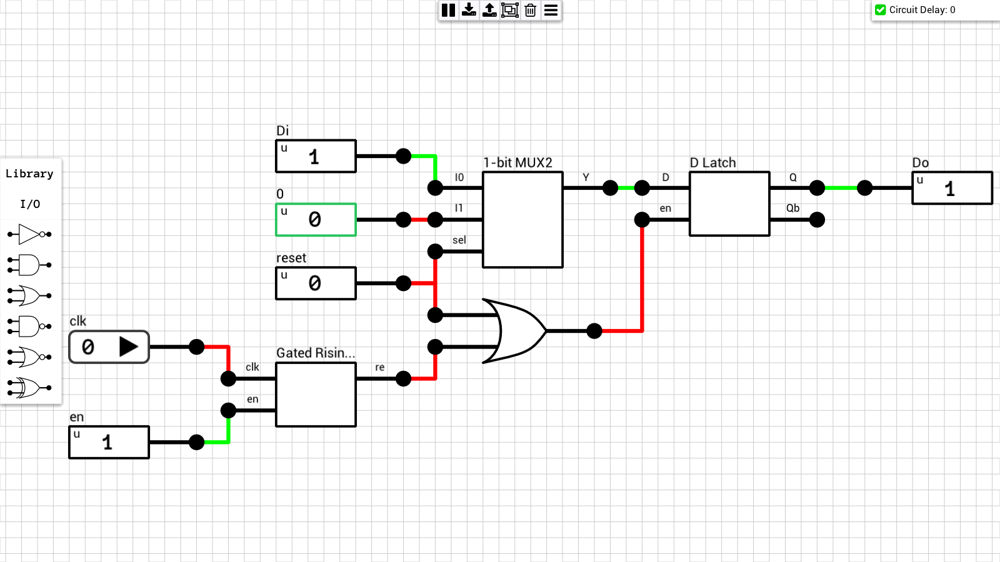
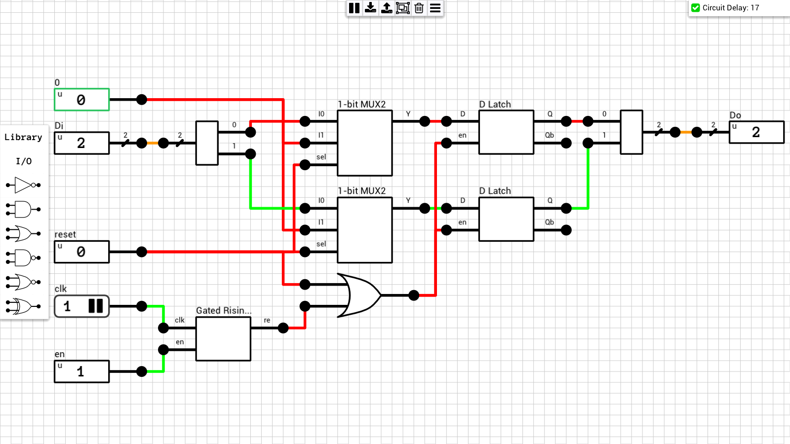
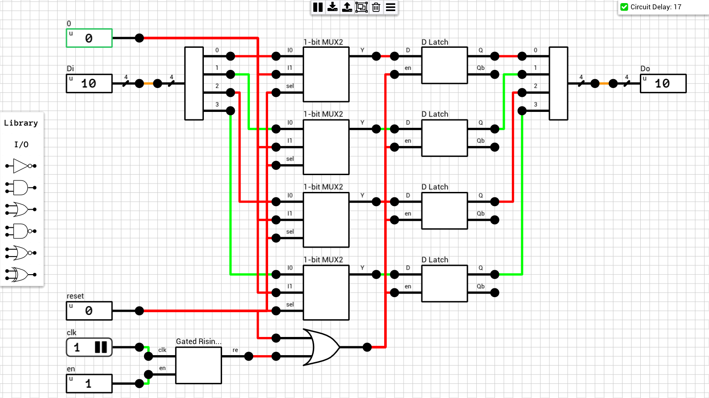

Memory components (latches and registers). Note that all registers use the [Rising Edge Detector](https://github.com/jdryg/dls-schematics/tree/master/Misc#rising_edge) from the Misc category.

## Table of contents
* [SR Latch (Active Low)](#sr_latch_al)
* [SR Latch (Active High)](#sr_latch_ah)
* [Gated SR Latch](#gated_sr_lath)
* [D Latch](#d_latch)
* [JK FlipFlop with Async Preset/Clear](#jk_ff_async_control)
* [1-bit Register](#reg1)
* [2-bit Register](#reg2)
* [4-bit Register](#reg4)
* [8-bit Register](#reg8)
* [1-bit Register w/ Async reset](#reg1_ar)
* [2-bit Register w/ Async reset](#reg2_ar)
* [4-bit Register w/ Async reset](#reg4_ar)
* [8-bit Register w/ Async reset](#reg8_ar)

## Schematics

### SR Latch (Active Low)
[Schematic](SR%20Latch%20(Active%20Low).sch)  
")

### SR Latch (Active High)
[Schematic](SR%20Latch%20(Active%20High).sch)  
")

### Gated SR Latch
[Schematic](Gated%20SR%20Latch.sch)  

### D Latch
[Schematic](D%20Latch.sch)  

### JK FlipFlop with Async Preset/Clear
[Schematic](JK%20FlipFlop%20(Async%20control).sch)  

### 1-bit Register
[Schematic](1-bit%20Register.sch)  

### 2-bit Register
[Schematic](2-bit%20Register.sch)  

### 4-bit Register
[Schematic](4-bit%20Register.sch)  

### 8-bit Register
[Schematic](8-bit%20Register.sch)  

### 1-bit Register w/ Async reset
[Schematic](1-bit%20Register%20(Async%20reset).sch)  

### 2-bit Register w/ Async reset
[Schematic](2-bit%20Register%20(Async%20reset).sch)  

### 4-bit Register w/ Async reset
[Schematic](4-bit%20Register%20(Async%20reset).sch)  

### 8-bit Register w/ Async reset
[Schematic](8-bit%20Register%20(Async%20reset).sch)  

