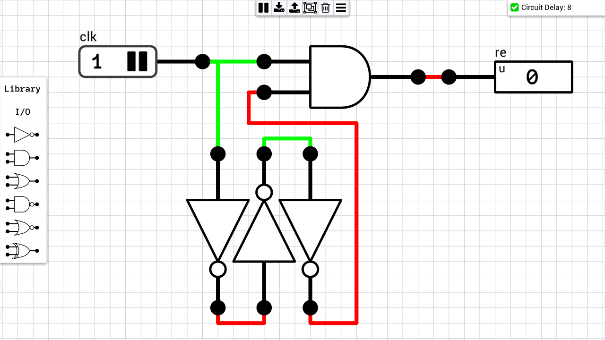
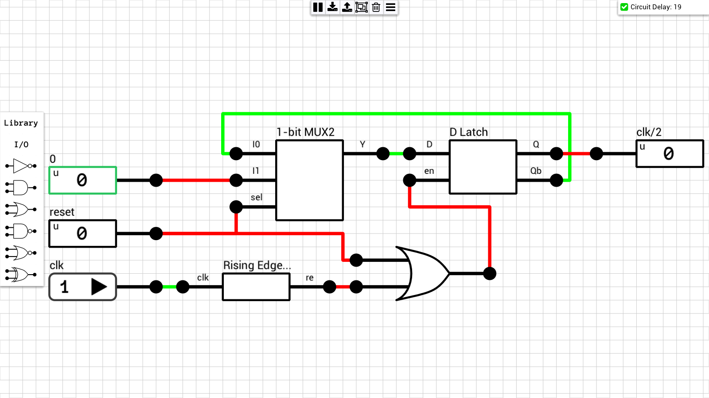
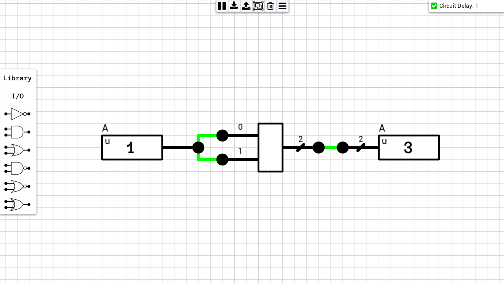
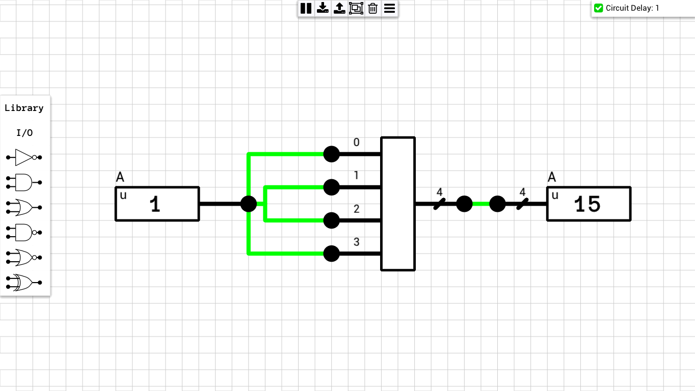
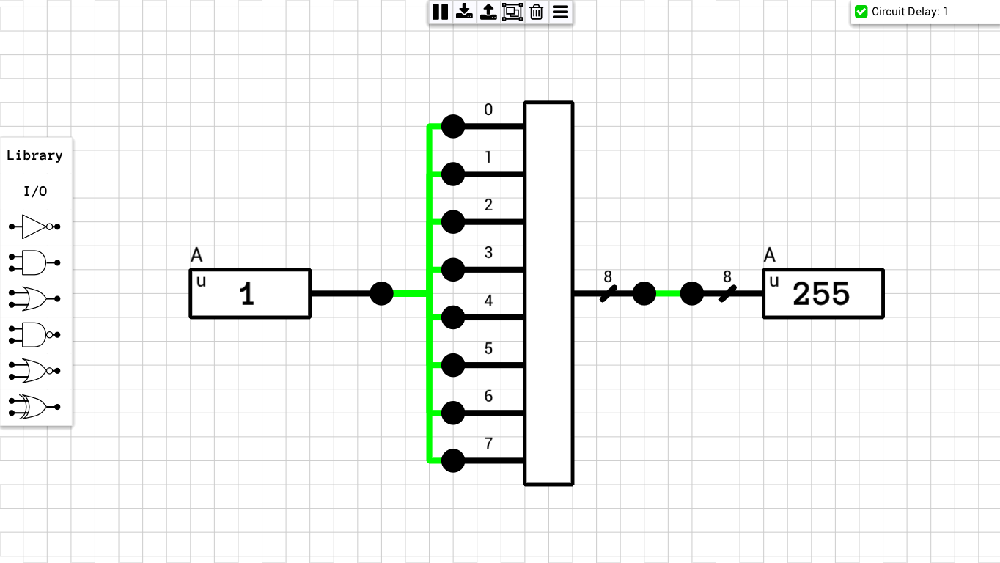

Miscellaneous/helper components which do not fit in any other category.

## Table of contents
* [Rising Edge Detector](#rising_edge)
* [Clock Divider](#clk_div)
* [1-to-2 Replicator](#1to2_replicator)
* [1-to-4 Replicator](#1to4_replicator)
* [1-to-8 Replicator](#1to8_replicator)

## Schematics

### Rising Edge Detector
[Schematic](Rising%20Edge%20Detector.sch)

This circuit generates a pulse in the output, every time the clock input goes from 0 to 1. The pulse is 3 gate delays wide. Due to the way the simulator works, you will never see a high output. Internally the circuit changes state multiple times during a simulation cycle, and all the changes propagate correctly to the rest of the circuit (i.e. whatever component is connected to this circuit's output). But since the final output from the last NOT gate will always be the opposite of the clock input, the output from the AND gate will always be 0. In the table below you can see the propagation of events for each internal simulation tick (inputs to each gate are shown; * is the last stable state of the circuit; values in bold indicate changes).

| t | 1st NOT | 2nd NOT | 3rd NOT | AND A | AND B | Output |
|---|---------|---------|---------|-------|-------|--------|
| * | 0     | 1     | 0     | 0     | 1 | 0 |
| 0 | **1** | 1     | 0     | **1** | 1 | **1** |
| 1 | 1     | **0** | 0     | 1     | 1 | 1 |
| 2 | 1     | 0     | **1** | 1     | 1 | 1 |
| 3 | 1     | 0     | 1     | 1     | **0** | **0** |

### Clock Divider
[Schematic](Clock%20Divider%20(Async%20reset).sch)

### 1-to-2 Replicator
[Schematic](1-to-2%20Replicator.sch)

### 1-to-4 Replicator
[Schematic](1-to-4%20Replicator.sch)

### 1-to-8 Replicator
[Schematic](1-to-8%20Replicator.sch)

