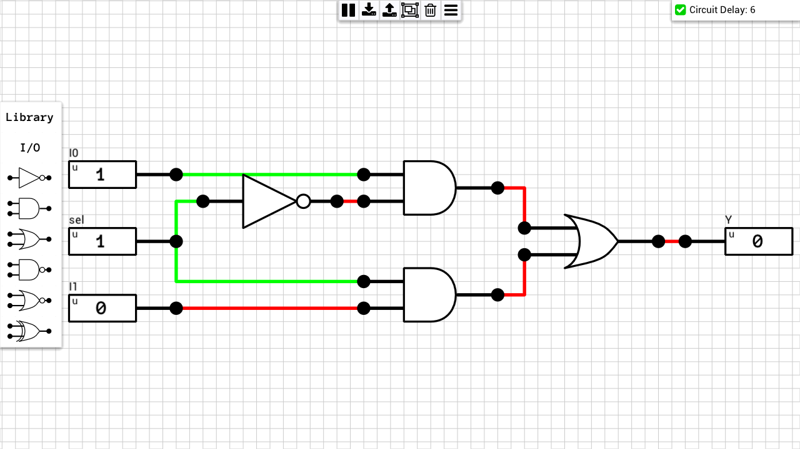
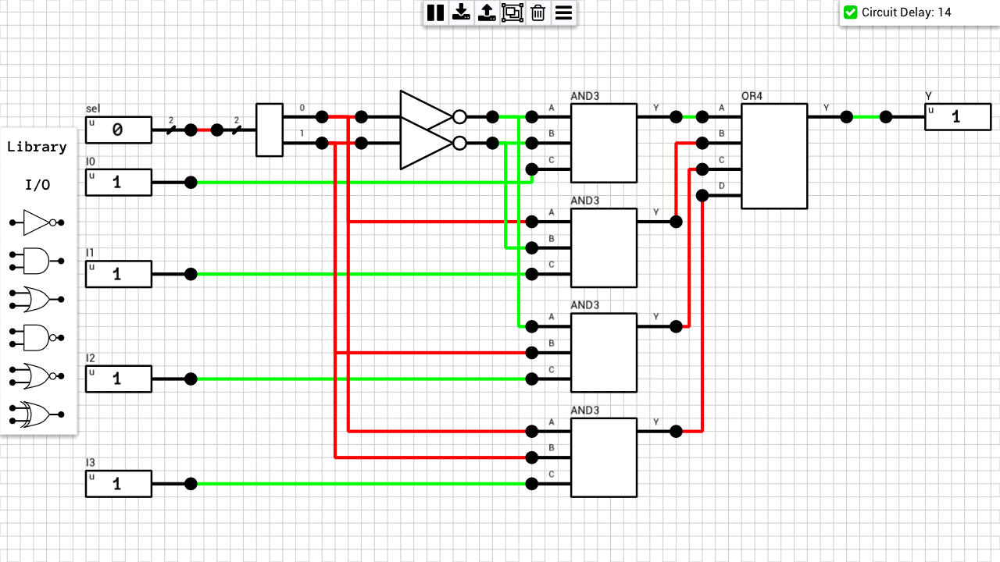

Multiplexers (or MUX) are circuits which select one of the N input signals and forward it to the output. 

## Table of contents
* [1-bit MUX2](#1bit_mux2)
* [1-bit MUX4](#1bit_mux4)
* [1-bit MUX4 (alternative)](#1bit_mux4_alt)

## Schematics

### 1-bit MUX2
[Schematic](1-bit%20MUX2.sch)  

### 1-bit MUX4
Uses [3-input AND gates](https://github.com/jdryg/dls-schematics/tree/master/1-bit%20Multi-input%20Gates#and3)  
[Schematic](1-bit%20MUX4.sch)  

### 1-bit MUX4 (alternative)
Uses a [2-to-4 Decoder](https://github.com/jdryg/dls-schematics/tree/master/Decoders#2to4_decoder)  
[Schematic](1-bit%20MUX4%20(alt).sch)  
")
