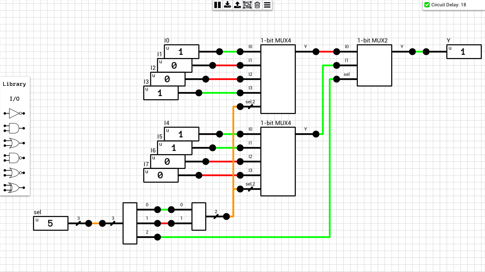
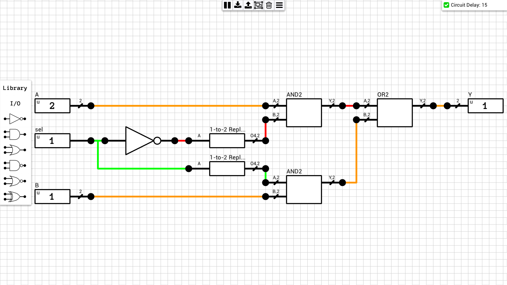
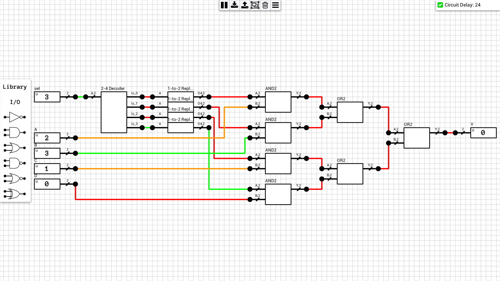
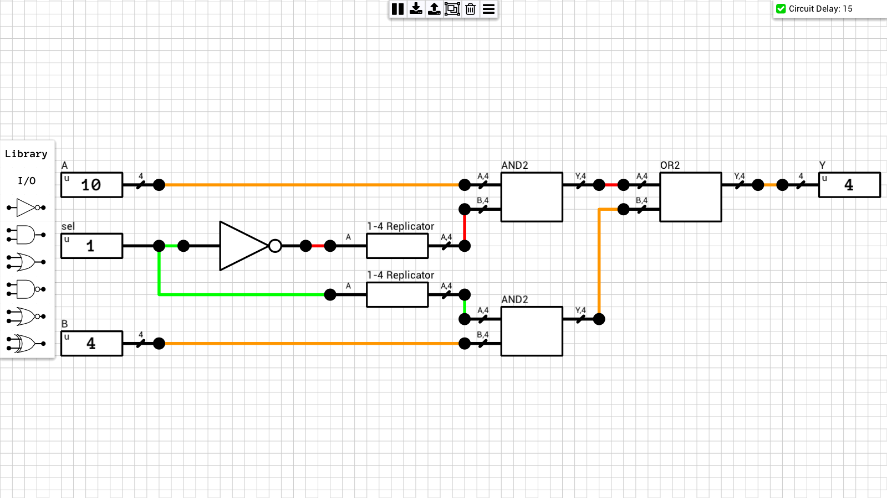
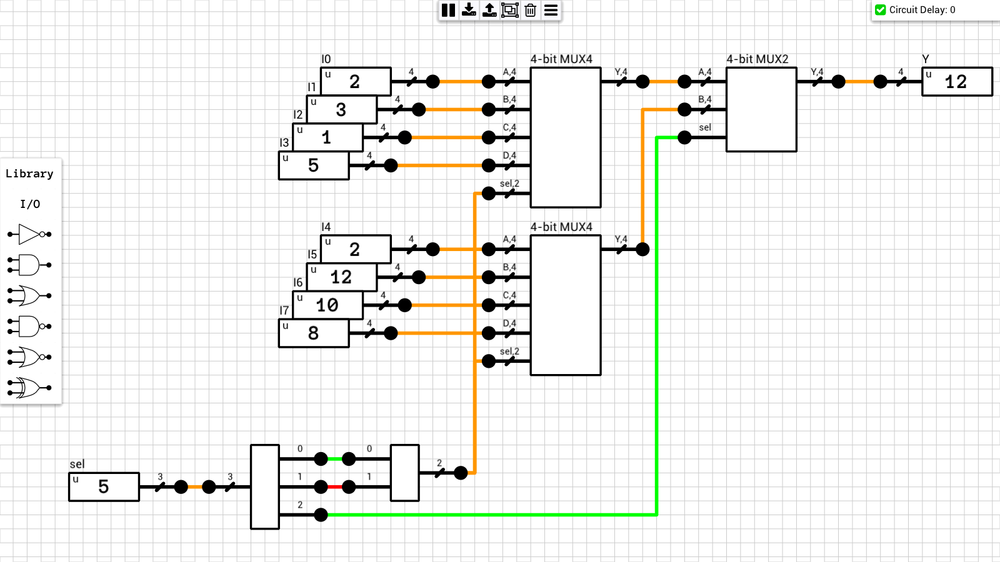
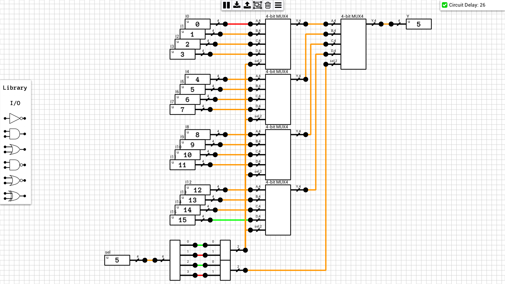

Multiplexers (or MUX) are circuits which select one of the N input signals and forward it to the output. 

## Table of contents
* [1-bit MUX2](#1bit_mux2)
* [1-bit MUX4](#1bit_mux4)
* [1-bit MUX4 (alternative)](#1bit_mux4_alt)
* [1-bit MUX8](#1bit_mux8)
* [1-bit MUX16](#1bit_mux16)
* [2-bit MUX2](#2bit_mux2)
* [2-bit MUX4](#2bit_mux4)
* [4-bit MUX2](#4bit_mux2)
* [4-bit MUX4](#4bit_mux4)
* [4-bit MUX8](#4bit_mux8)
* [4-bit MUX16](#4bit_mux16)

## Schematics

### 1-bit MUX2
[Schematic](1-bit%20MUX2.sch)  

### 1-bit MUX4
Uses [3-input AND gates](https://github.com/jdryg/dls-schematics/tree/master/1-bit%20Multi-input%20Gates#and3)  
[Schematic](1-bit%20MUX4.sch)  

### 1-bit MUX4 (alternative)
Uses a [2-to-4 Decoder](https://github.com/jdryg/dls-schematics/tree/master/Decoders#2to4_decoder)  
[Schematic](1-bit%20MUX4%20(alt).sch)  
")

### 1-bit MUX8
[Schematic](1-bit%20MUX8.sch)  

### 1-bit MUX16
[Schematic](1-bit%20MUX16.sch)  

### 2-bit MUX2
[Schematic](2-bit%20MUX2.sch)  

### 2-bit MUX4
[Schematic](2-bit%20MUX4.sch)  

### 4-bit MUX2
[Schematic](4-bit%20MUX2.sch)  

### 4-bit MUX4
[Schematic](4-bit%20MUX4.sch)  

### 4-bit MUX8
[Schematic](4-bit%20MUX8.sch)  

### 4-bit MUX16
[Schematic](4-bit%20MUX16.sch)  

