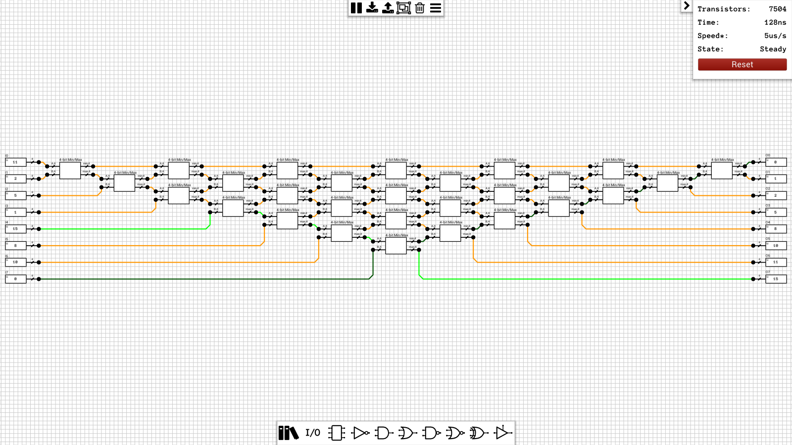
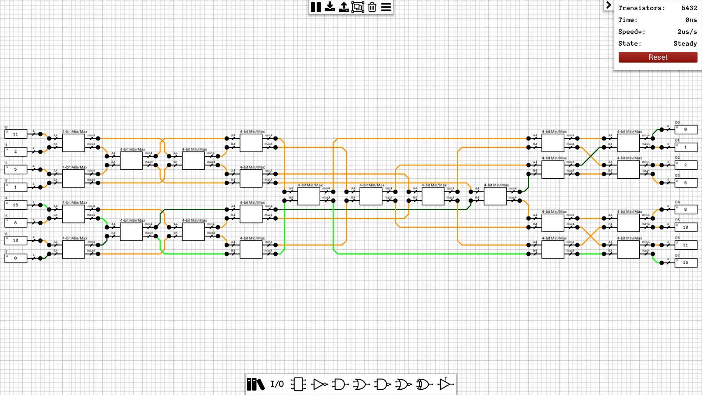
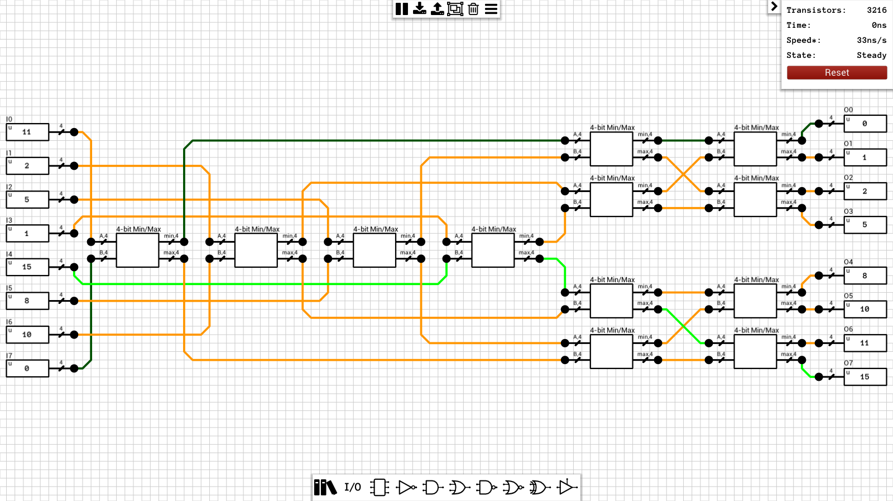
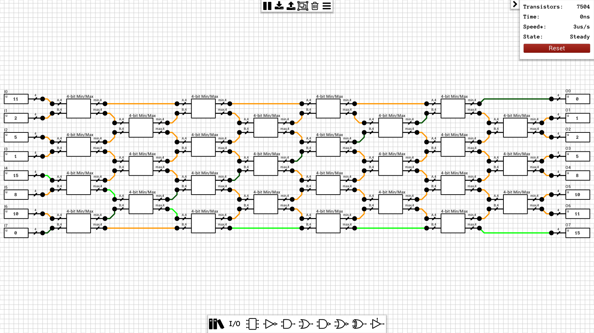

Sorting networks are circuits which get N M-bit values as inputs and return the same numbers sorted in ascending (or descending) order.

## Table of contents
* [8x4-bit Insertion sort](#8x4_insertion)
* [8x4-bit Merge sort](#8x4_merge)
* [8x4-bit Bitonic sort](#8x4_bitonic)
* [8x4-bit Odd-even sort](#8x4_oddeven)

## Schematics

### 8x4-bit Insertion sort
[Schematic](8x4-bit%20Insertion%20sort.sch)  

### 8x4-bit Merge sort
[Schematic](8x4-bit%20Merge%20sort.sch)  

### 8x4-bit Bitonic sort
[Schematic](8x4-bit%20Bitonic%20sort.sch)  

### 8x4-bit Odd-even sort
[Schematic](8x4-bit%20Odd-even%20sort.sch)  

