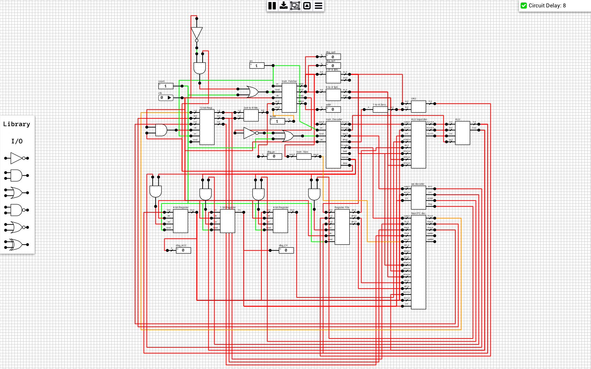

An [i4004](https://en.wikipedia.org/wiki/Intel_4004) compatible CPU. 

The CPU understands all 2-byte instructions, all accumulator instructions, except from `KBP` and `DCL`, and all one word machine instructions, except from `SRC` and `FIN`. I/O and RAM instructions haven't been implemented.

All required components are already included in the schematic, so there's no need to add them separately. You can inspect the components and save their schematics as separate files if you want.

Finally, the current implementation doesn't include an address register (PC stack), but if you connect one to the NextPC decoder, JMS should work.

## Schematic
### i4004
[Schematic](i4004.sch)

