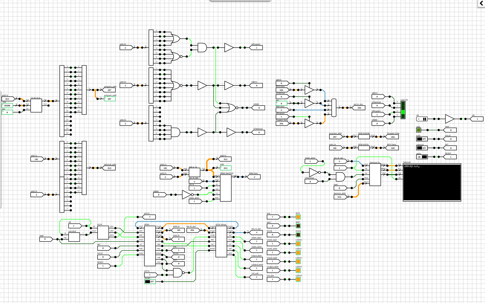
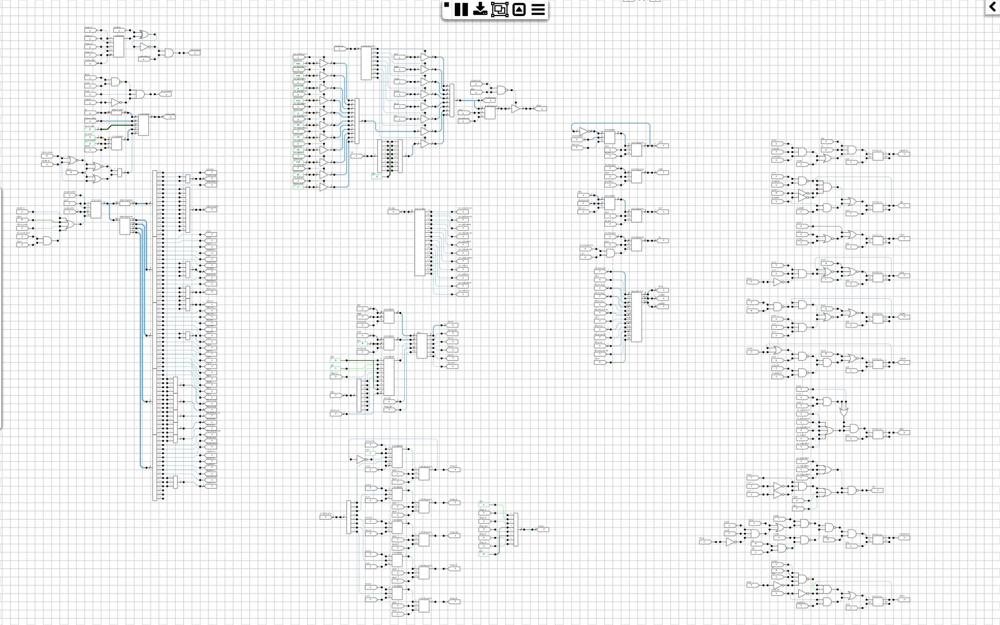
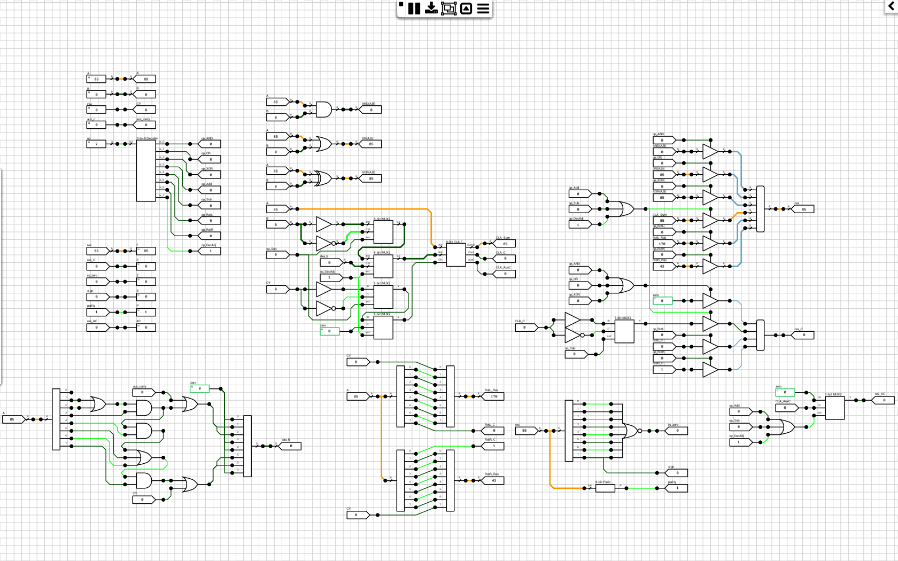
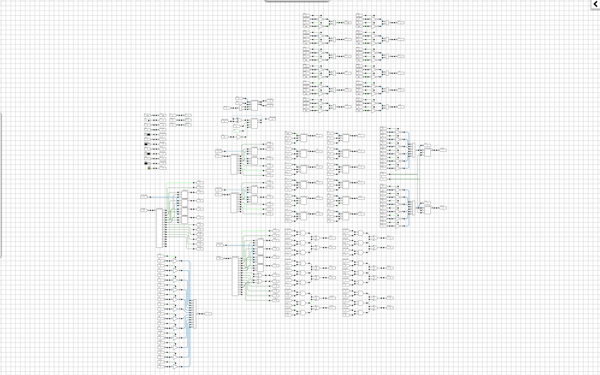
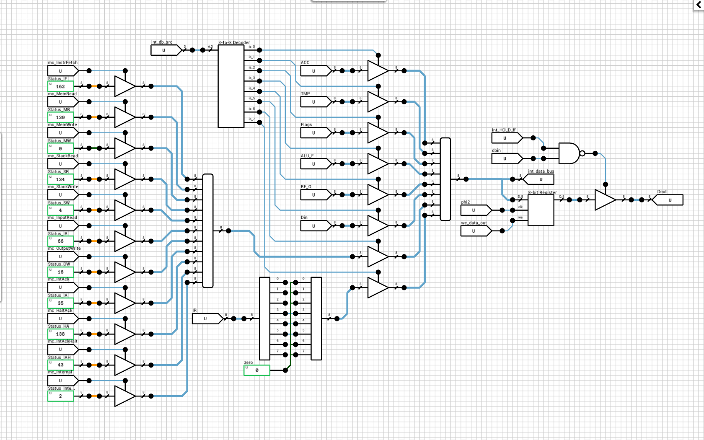

An [i8080](https://en.wikipedia.org/wiki/Intel_8080) cycle accurable CPU build from logic gates and ROMs. 

**NOTE**: Requires DLS 0.13.0 and up (schematic version 2.1).

## Schematic
### i8080 System with a 512x320 1bpp display
[Schematic](i8080 System.sch)

### i8080 CPU [Large version](https://raw.githubusercontent.com/jdryg/dls-schematics/raw/master/i8080/images/i8080_large.png)

### i8080 ALU

### i8080 Register File

### i8080 Internal Data Bus

